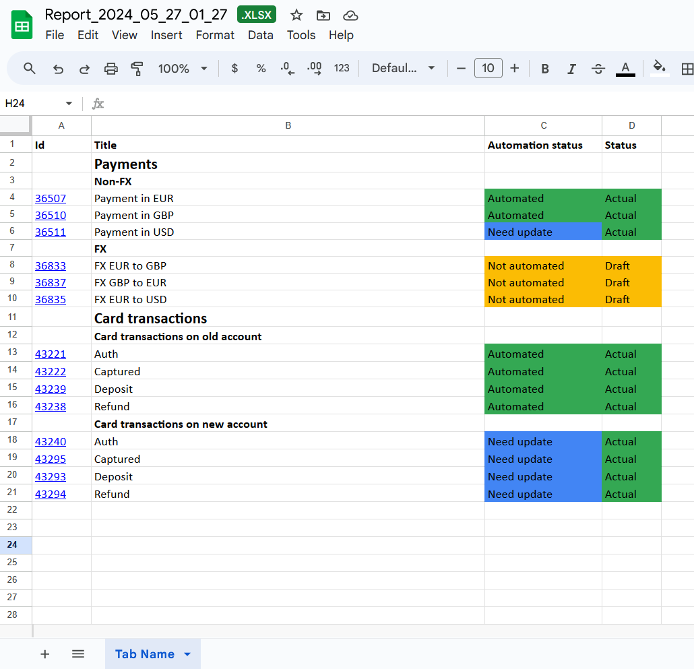
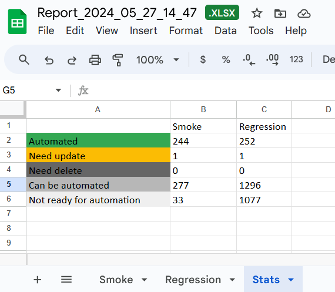

# TestRail To XLSX

Get data from TestRail API and export to XLSX.





## Project installation

1. Install Node.js on PC
2. Install Visual Studio Code (VSC) and recommended extensions: Babel JavaScript, JavaScript (ES6), Code Runner, Office Viewer(Markdown Editor)
3. Clone git repository and open in VSC
4. Open terminal in VSC and run “npm install --save-dev” command
5. Now you can open Main.js file and run

## TestRail settings

1. Enable API on ADMINISTRATION - Site Settings - API page
2. Generate API key on My Settings - API KEYS page

## Project configs

### testrail.json

* baseURL - base url of TestRail in "domain.testrail.io" format
* login - login email for which apiKey was generated in TestRail
* apiKey - apiKey generated in TestRail

### report.json

Tab will be generated in XLSX report for every config.

* name - name of tab in XLSX report
* project_id - id of testrail project
* suite_id - id of testrail suite
* filters - every filter must start with "&" and define filtration value, e.g. "&is_deleted=0", you can apply many filters for the same field, e.g. "&priority_id=3,4" will include only test-cases with 3 and 4 priorities
* group_by - test-cases are grouped by this field, remove it to skip grouping, it also affects group statistics, #tags are ignored, e.g. "Category #tags" is counted as "Category"
* show_groups - displaying or hiding group names in the report
* show_without_group - displaying or hiding test cases without set group field
* sections_max_depth - displaying section names if its depth is less
* statistics - statistics from statistics.json that is used for this config

### xlsx.json

For adjustment of column width to its content:

* min_width is min column width
* max_width is max column width
* character_width is approximate width of 1 character that is used for calculation

Styles for heading, groups and sections cells:

* heading_style
* group_style
* section_style

There is ability to add custom colors for the columns with options. For example, for "custom_status" with "Draft", "Actual", "Need update", "Outdated" options you can set colors in the next way:

```
"custom_status":{
        "Draft": "fbbc04",
        "Actual": "34a853",
        "Need update": "4285f4",
        "Outdated": "cccccc"
    }
```

### statistics.json

- summary_enabled - enable or disable summary statistics for all tabs
- group_enabled - enable or disable statistics by group for every tabs
- tabName - name of the tab with summary statistics
- column - test case property that is used for statistics
- columnName - name of column that can be added as "statistics_status" to "columns" in report.json
- skipped_status - default value if no rule is applied to test case
- rules describe how test case is counted when calculating statistics
- postfix is used for generating tab name for group statistics

Example of "default" statistics rules: statistics is calculated for "Automated", "Can be automated" and "Not ready for automation" statuses. For "Automated" status only test-cases with "custom_automation_status": "Automated" and "custom_status": "Actual" are counted.

```
"default": {
        "postfix": "",
        "rules": {
            "Automated": [
                {
                    "custom_automation_status": "Automated",
                    "custom_status": "Actual"
                }
            ],
            "Can be automated": [
                {
                    "custom_automation_status": "Not automated",
                    "custom_status": "Actual"
                }
            ],
            "Not ready for automation": [
                {
                    "custom_status": "Draft"
                },
                {
                    "custom_status": "Need update"
                }
            ]
        }
    }
```

## Locale

If you copy the result to other document, please pay attention to locale of both XLSX files. Formulas separator, dates format and numbers format can be different for them. Set the same locale for both files to avoid any issues.
